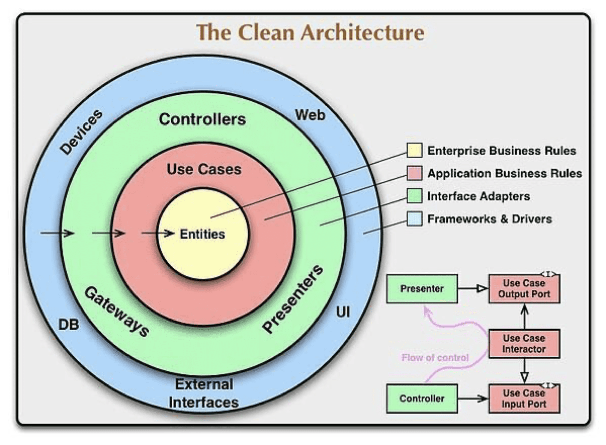

<!--_class: lead-->
# "가볍게 만나보는 클린 아키텍처"

### 정현석

---
<!--
paginate: true
_class: lead
-->
## 클린 아키텍처의 목표는 무엇일까?

---
<!--_class: lead-->
## 애자일 매니페스토 - 일부

절차와 도구보다는 **개성과 화합을**

방대한 문서 작업보다는 **동작하는 소프트웨어를**

계약 조건에 대한 협상보다는 **고객과의 협력을**

계획을 따르는 것을 넘어서서 **변화에 대처하는 것을**

---
<!--_class: lead-->
## 파이썬의 선 - 일부

아름다운 코드는 지저분한 코드보다 낫다.

명확한 코드는 암시적인 코드보다 낫다.

단순한 코드가 복잡한 코드보다 낫다.

복잡한 코드가 난해한 코드보다 낫다.

단조로운 코드가 복잡한 코드보다 낫다.

읽기 쉬운 코드는 읽기 어려운 코드보다 낫다.

---
<!--_class: lead-->
##	그리고... 클린 아키텍처

The goal of software architecture is to minimize the human resources required to build and maintain the required system.

― Robert C. Martin, Clean Architecture

소프트웨어 아키텍처의 목표는 필요한 시스템을 만들고 유지보수하는 데  투입되는 **인력을 최소화** 하는데 있다.

<!--
1. 생산성: 적은 인원으로 많은 일을 한다
2. 커뮤니케이션 비용: 혼자 개발 다하면 커뮤니케이션 비용 ZERO
-->
---
## 소프트웨어의 두 가치 
	
### - 행위
- 시스템이 원하는 대로 동작하게 하는 것
	
### - 구조
- 시스템을 더 쉽게 변경할 수 있도록 하는 것 - **훨씬 중요하다.**

---
## 규모별 클린 아키텍처 원칙

- 설계의 원칙: 코드 레벨에서의 원칙
- 컴포넌트의 원칙: 클래스와 모듈을 어떻게 묶어 하나의 컴포넌트를 만들 것인가
- 컴포턴트 결합의 원칙: 컴포넌트들 간의 관계

---
## 설계의 원칙
가장 작은 코드 레벨에서의 설계원칙: SOLID 

- SRP: 변경 이유 딱 하나
- OCP: 기존에 것을 건드리지 않고 새로운 것을 뚝딱 추가
- LSP: 하나를 빼고 다른 걸 넣을 수 있어야 한다.
- ISP: 인터페이스에 꼭 필요한 것만 넣는다. 풀스택 노노
- DIP: 데이터베이스(MySQL)가 서비스에 의존성을 가지거나 API 서버가 UI에 의존성을 가지면 안되지! 
		- **중간에 인터페이스를 두자**

---
## 컴포넌트 (하나를 만드는 것에 대한) 원칙
조금 더 큰 덩어리의 클래스와 모듈들을 어떻게 묶을 것인가에 대한 이야기 

- REP: 하나의 컴포넌트로 묶어놓은 클래스, 모듈들은 함께 릴리즈 되어야 한다.
	- 그러니 관련 없는 놈들은 **떨어져!**

반대로 어떤 놈들을 하나로 묶을 것인가?
- CCP: 동일 이유 동일 시점에 변경되는 녀석들이다. **모여라!**
- CRP: 이것 쓸 때, 저것도 쓴다면 묶어주자. 서로 의존성이 있는거다. **모여라!**

---
## 컴포넌트(들 끼리의) 결합
가장 작은 단위에서 SOLID를 보고
컴포넌트에 대해서 REP, CCP, CRP를 보았으니 
이제는 컴포넌트들 끼리의 결합 원칙을 본다.

- ADP: 의존성 순환되면 큰일난다.
- SDP: 나를 의존하는 놈들이 너무 많으면 맘대로 변경을 못한다. 
	- DIP로 나 말고 인터페이스를 의존하라구 하하
- SAP: 추상클래스나 인터페이스를 많이 쓰라는 말씀. 컴포넌트 버전의 DIP
	- 전체 클래스에서 추상클래스, 인터페이스 비율이 높을수록 좋다.

---
		
## 아키텍처가 뭔지 다시 생각해보자

시스템의 아키텍처를 짠다는 것은
- 시스템을 컴포넌트로 **나누고**
- 나눈 컴포넌트를 **배치하고**
- 컴포넌트들끼리 어떻게 **소통할지** 결정하는 것

아키텍처를 잘 짜면
- 쉽게 **개발, 배포, 운영, 유지보수**를 할 수 있다. 

---
## 다시 한 번 돌아보는 소프트웨어의 두 가치 

### - 행위와 구조

- 아키텍처는 **구조**에 대한 이야기이다. 
- 아키텍처는 **행위**에는 관심이 없다. 
	- 동작하는지 여부는 관심이 없다.(극단적으로 말해봄) 
- 아키텍처는 쉽게 **개발**하고, 한 방에 **배포**하고, **운영**하기 좋고, **유지보수*하기 좋게 만드는 것이 목표이다. 

---

## 정책과 세부사항

**정책**은 시스템의 가장 핵심적인 요소이다. 
- 비즈니스 로직이다.

**세부사항**은 정책과 무관하게 ~~만들 수 있다.~~ 만드는 게 좋다. 
- 정책과 세부사항을 분리시키자. **Decoupling!**
- 세부사항들로는 데이터베이스, 웹서버, 의존성 주입 프레임워크 등이 있다. 

---
## 클린 아키텍처 다이어그램

의존성은 안쪽을 향한다.
- 내부는 외부를 알지 못한다. 
- 식당 요리사는(비즈니스 로직) 배달 업체를 알지 못한다. 

바깥쪽의 데이터 형식을(DTO) 내부원에서 사용하지 않는다. 
- 별도의 Entity, DAO
	
---
<!--_class: lead-->
## 실전 예제 

### Golang - MongoDB  CRUD API server

---
## 코드 들여다보기

GitHub(private): https://github.com/nicewook/mongo-golang

- Sequence diagram
	- 실제 코드 구조 및 모듈별 분리
- DTO, Entity
- DIP(Dependency Inversion Principle)

---
<!--_class: lead-->
## 끝
**마무리하며**
아직 낯서신 분들은 클린 아키텍처랑 
처음 얼굴 익힌 시간이라 생각해주셨으면 합니다. 

**돌아가며 한 말씀씩만 부탁드립니다**
좋았던 것, 이해 안되었던 것, 그 다음 궁금한 것
그리고 기분 점수 

